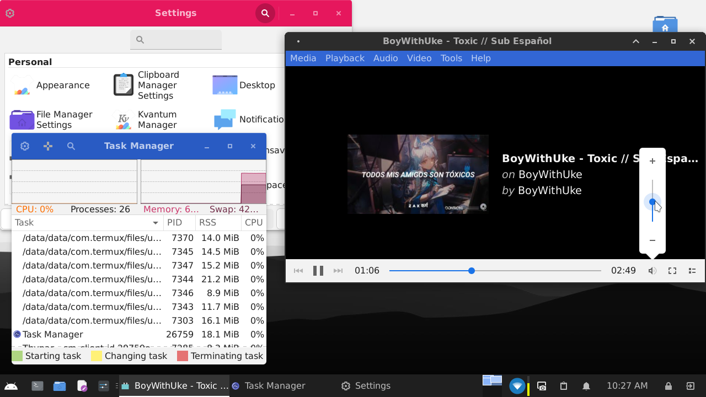
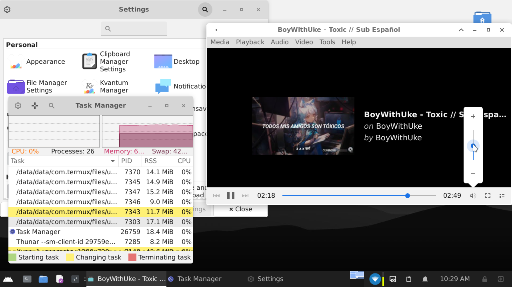
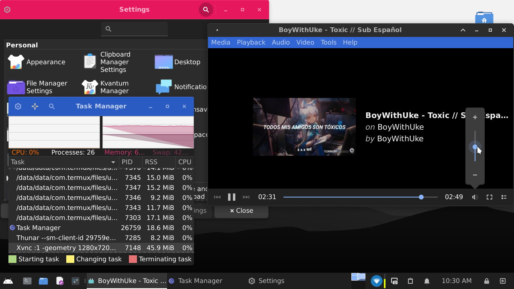

# tdx-gtk-theme
A gtk theme for termux-desktop-xfce

# Preview

### tdx


### tdx-light



### tdx-dark



## Installation

```bash
curl -LO https://github.com/Yisus7u7/tdx-gtk-theme/releases/download/tdx-1.2.1/tdx-gtk-theme_1.2.1_all.deb
apt install ./tdx-gtk-theme_1.2.1_all.deb
rm tdx-gtk-theme_1.2.1_all.deb
```
